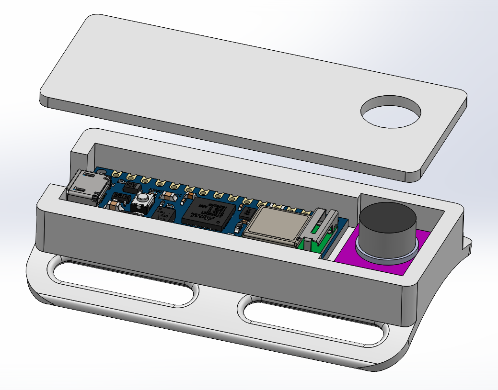

# PRec

PREC is a simple device combining an Arduino nano33 and a MAX9814 mic.
The device stream the data of the nano's 3-axis accelerometer and the data of the MAX9814 microphone. 
The data can be easily retrived via the python script of this porject.
It connects the computer to the device via bluetooth and let you record in CSV files the different streams of data.

 